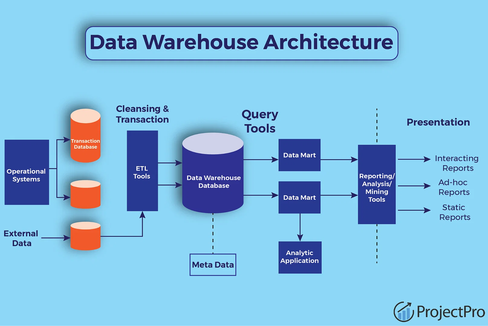

# Data Warehouse for Online Retail store

Masters in Data Science and Engineering  
Faculdade de Engenharia da Universidade do Porto

[Cátia Teixeira](https://github.com/crdsteixeira) | [Rojan Aslani](https://github.com/RojanAsl) | [Miguel Veloso](https://github.com/cmiguelsv) | [Luís Henriques](https://github.com/LuisPHenriques)

A data warehouse, an infrastructure to store data, was created with 2 stars - information from several tables combined into two tables with different purposes - and a sales cube - aggregated sales by month or customer segment given frequent queries made -, to store data from an online retail store. This data was retrieved from Kaggle.

## Implementation

This was built using PostgreSQL, pgAdmin 4, Pentaho PDI, and PowerBI, in order to create a data warehouse from scratch, considering the dataset chosen.

## Steps involved

* Setup
  1. The Data Warehouse was implemented using PostgreSQL;
  2. The ETL was developed using Pentaho PDI;  
  3. The mondrian schema was done using Penatho Shema Workbench; 
  4. The dashboards required the use of Microsoft Power BI;

* Create dimensions
  1. Create schema inside a database in postgres;
  2. Open transformations (ETL) for dimensions tables (customer, time, location, product) in Pentaho PDI Kettle - 'Spoon' dir;
  3. Configure source csv to local path in each transformation file;
  4. Configure your local db connection in 'Table Output' in each transformation file;
  5. Run to create tables and populate them;

* Create facts and agg tables
  1. Open trasformation (ETL) for facts and aggregation tables in Pentaho (order_item, order, agg_sales);
  2. Configure source csv to local path in each transformation file;
  3. Configure each 'Table Input' in each file for your local db connection where dimensions were created;
  4. Configure 'Table Output' in each file for your local db connection;
  5. Run to create tables and populate them;

* Create dashboards and cube in PowerBI
  1. Load the data from PostgreSQL, the data warehouse, to PowerBI;
  2. Create dashboards;
  3. Compute sales aggregations by creating a data cube, making it faster for frequent queries made for decision making;

## Future works

* Use other tools to create the data cube;
* Explore in a production line how efficient and what efficiency improvements could be done to the ETL pipelines;
